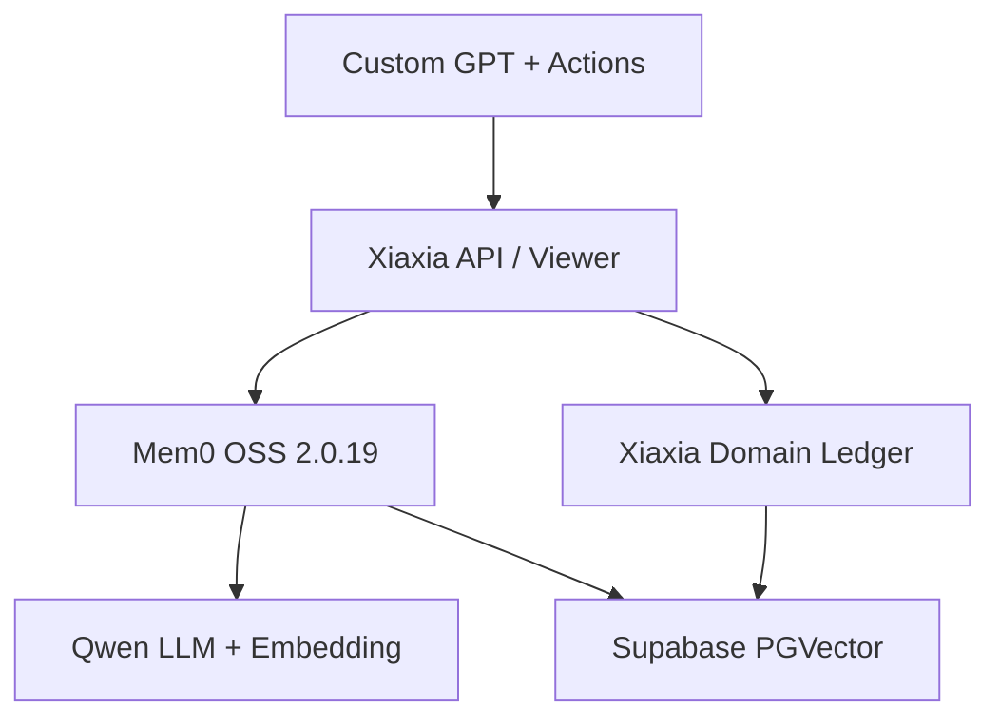

# 新架构说明

## 一句话结论

Mem0 OSS 2.0.19 是唯一权威 Memory Engine；Xiaxia 只解释 Memory 在共同关系历史中的含义和生命周期。过去可以被修订、淡化、推翻，但不会被伪装成从未发生。

## 职责矩阵

| 能力 | Mem0 2.0.19 | Xiaxia Domain Layer |
|---|---|---|
| Memory 正文与唯一 ID | 权威 | 仅引用 `mem0_id` |
| conversation extraction | `add(infer=True)` | 不提取；只分类 Mem0 已提取结果 |
| structured relationship 保存 | `add(infer=False)`，原义正文 | 校验 subtype、importance、time、source |
| embedding / vector storage | Qwen embedder + 官方 PGVector provider | 不实现、不存储 |
| semantic search | `search()` | 对返回 ID 批量补充 lifecycle，并执行 subtype/time/importance 约束 |
| 正文编辑 | `update(text=...)`，同步重建 embedding | 同事务语义下追加 audit；失败补偿回滚 Mem0 |
| 删除 | `delete()` | pending → Mem0 delete → audit tombstone；Mem0 失败则恢复 active 状态 |
| relationship / supersede | metadata 接收当前状态，旧正文仍留在 Mem0 | 权威 lifecycle 链与审计；默认搜索排除 superseded |
| Legacy Import | 每条调用 `add(infer=False)` | period、幂等键、批次、失败补偿 |
| Viewer | 不使用 Mem0 Dashboard | Xiaxia 移动端 Viewer 调用上述 facade |

## 运行拓扑

`MemoryEngine` 类名保留为应用 facade，而不是第二个引擎。它只编排 Mem0 与 Domain Ledger 的一致性；其中不存在 embedding 调用、向量距离 SQL、正文表或自研 semantic search。

## 旧 → 新数据流

| 场景 | 旧实现 | 新实现 |
|---|---|---|
| raw conversation | Xiaxia/Qwen 提取，再写自研 `memories`，旁路同步 Mem0 | Mem0 `add(infer=True)` 直接决定 Memory；Xiaxia 仅给结果分类并写 ledger |
| structured relationship | 自研正文表是权威，Mem0 是 sidecar | Mem0 `add(infer=False)` 返回唯一权威 ID；ledger 引用该 ID |
| search | Xiaxia 自建 embedding + `<=>` SQL | `Mem0.search()` 是语义检索主体；ledger 批量 join |
| Viewer edit | 改 Xiaxia 正文，存在 embedding 漂移风险 | `Mem0.update(text=...)` 先更新正文和 embedding，再写 ledger/audit |
| delete | 软删一侧可能留下向量幽灵 | ledger pending；Mem0 delete 成功才确认 tombstone，失败回滚 |
| Legacy Import | 可能只进入 Xiaxia 表 | 每条真实 `Mem0.add(infer=False)`，精确重试由 import key 去重 |
| Recent Context | ledger/自研正文读取或逐条读取 | 有界 `Mem0.get_all()` + 一次 ledger `ANY(ids)`，再按关系语义编排 |

## 删除的重复自研能力

- 自研 conversation Memory extraction。
- 直接调用 embedding API 的应用代码。
- Xiaxia 自建向量列、向量写入和 `<=>` semantic search。
- `memories` 正文权威表的运行时依赖。
- `xiaxia_mem0_engine` 影子 collection 和双写开关。
- Viewer 绕过 Mem0 直接改正文。
- Recent/Viewer 的逐条 Mem0 `get()` N+1 读取。

## 保留的 Xiaxia-specific 能力

- semantic / episodic / relationship / taste / ongoing 分类。
- relationship 八个 subtype，尤其 milestone、boundary、conflict、repair、identity_shift。
- active / historical / superseded / archived 状态和双向 supersede 链。
- “过去是历史，不是未来命令”的 extraction instructions、Recent Context principle 与 Custom GPT 行为约束。
- conflict/repair/shared language 等关系意义由结构化保存者明确表达，不让 Mem0 二次改写。
- Viewer 搜索、筛选、编辑、删除和审计历史。
- Legacy Window Import、精确幂等重试、批次记录与失败补偿。
- Bearer Token、Viewer session protection、保守 OpenAPI schema。

## 一致性顺序

结构化创建采用 `Mem0.add → ledger create`；ledger 失败会删除刚创建的 Mem0 并将可能已经存在的 ledger 行转成 audit tombstone。编辑采用 `Mem0.update → ledger update`；ledger 失败则用旧正文和旧 metadata 调用 Mem0 update 回滚。删除采用 `ledger pending → Mem0.delete → ledger confirm`；Mem0 失败则恢复 ledger。Supersede 会先更新旧 Mem0 metadata，再在一个 ledger transaction 中连接新旧 ID；ledger 失败则恢复旧 metadata。

这是应用级补偿事务，不宣称 PostgreSQL 与外部 Qwen API 之间存在分布式 ACID。审计事件保留每次补偿痕迹。

## SQL 与连接预算

| 操作 | 典型持久层模式 |
|---|---|
| structured save | Mem0：1 次 embedding + 1 次 PGVector INSERT；ledger：1 INSERT + 1 audit INSERT（同一 transaction） |
| inferred save | Mem0 负责 extraction、existing-memory 判断和相应 vector 操作；Xiaxia 批量分类一次，逐结果补 metadata 与 ledger |
| search | 1 次 query embedding + 1 次 HNSW SELECT/LIMIT；1 次 ledger `ANY(ids)` |
| Recent | 1 次带 user/status/time/LIMIT 的 Mem0 list；1 次 ledger `ANY(ids)` |
| Viewer list/search | 1 次 Mem0 get_all/search；1 次 ledger `ANY(ids)`，上限 100 |
| edit | Mem0 定点 get/update/get；ledger 定点 update + audit；非高频管理路径 |
| delete | Mem0 定点 get/delete；ledger 两个短 transaction，保留失败补偿 |

Migration 预建主 collection、entity collection 和索引。应用只通过官方 `Memory.from_config()` 初始化，不调用 PGVector 的私有 `_ensure_collection()`。Mem0 2.0.19 会在每个 provider 实例第一次 `insert/search/get/list` 时内部执行一次 collection existence check，并用实例级 `_collection_ensured` 缓存；正确执行 migration 后不会产生请求级 DDL，也不会重复检查。`entity_store` 是 Mem0 的公开惰性属性，只在 entity linking 实际使用时创建对应 provider。Render 默认单 worker，最坏情况下 PostgreSQL pool 上限为 5（Domain 1 + Mem0 主 collection 2 + 惰性 entity collection 2）。无 polling、无无界全表读取。
